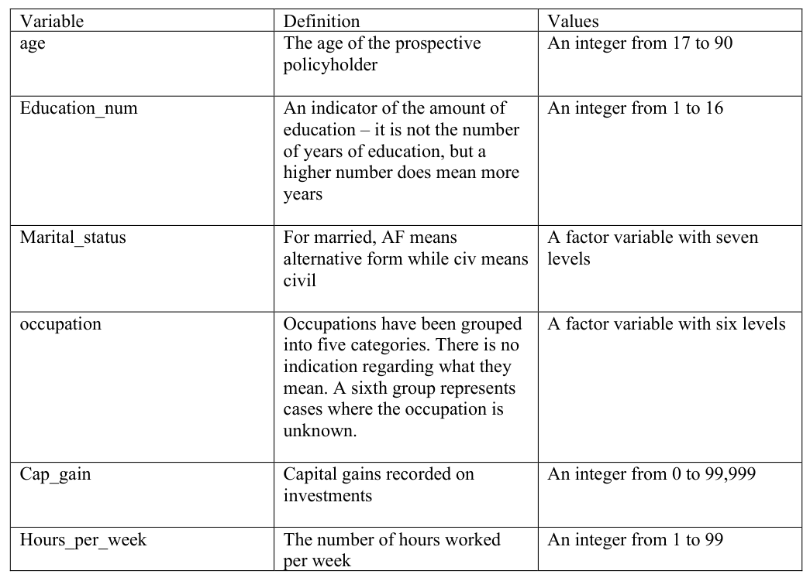
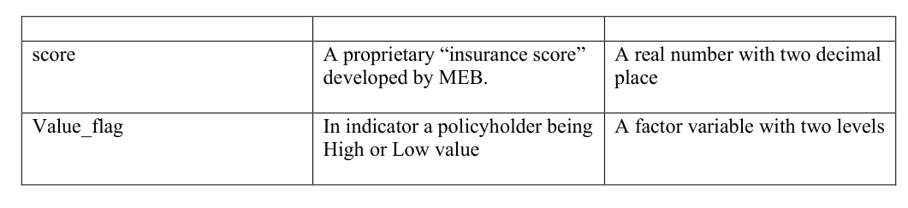

# stat305-Project

## Background Information
You are a risk analyst in an insurance and have been asked to assist the marketing department. They have been collecting data on past policyholders. For each policyholder they have determined if they are “high value” or “low value” based on profitability. They would like to be able predict for each prospective policyholder if they will be high or low value.  Your task is to use the available data to construct a model that will accurately predict if a potential customer will be high or low value. While predictive accuracy is more important to the marketing department than understanding the relationships of the predictors to the target variable, the marketing department will have more confidence in your work if the results make sense. The insurance company indicated that this analysis will only be applied to individuals age 25 and older.

## Research Question

## Required Items
* Data Visualizations
* Tabulations
* Hypothesis Testing 
* Simulations
* Max 5 tables and 5 visualizations
* Each figure/table needs a minimum of 1 paragraph to explain it.
* Code should be put at the end of the doc (in the appendix)
* Main report should not exceed 15 pages

## Report Guidelines

### Introduction
* Background info about data
* Background info about problem being solved
* Describe variables used
* State research question
* Explanations of statistical models used
* Should not be more than 3 pages

### Visualization
* Identify the scientific questions we can ask about the data
* Create new variables & information given the existing variables in the dataset
* Write custom functions to transform data

### Descriptive Statistics
* Show tables, diagrams, and descriptive stats (mean, median, mode, std. deviation, quartiles)
* Choose the most relevant graphs
* Visualizations, tables, hypothesis testing, and simulations

### Analysis
* Explain methodologies and simulation procedures.
* Ex. writing custom functions, running simulations, insightful visualizations, predictive models using machine learning techniques (regression tree, random forest, or neural network).

### Discussion
* Show understanding of project
* Restate research question.
* Ask questions about research process
* Evaluate all graphs & tables provided.

## Data Model

